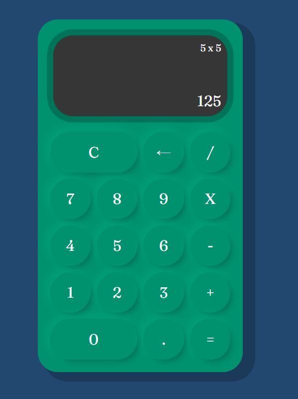

  

# Calculadora

  Una simple calculadora que realiza las operaciones básicas.

## ¿Qué es Calculadora?
Calculadora es una calculadora que calcula cálculos calculables, puedes probar la versión web [aquí](https://marfullsen.github.io/PR-Calculadora/).

## Capturas de pantalla

  

## Referencias

- [Versión original by Carlos Orellana](https://github.com/CarlosOrellana00/Calculadora)